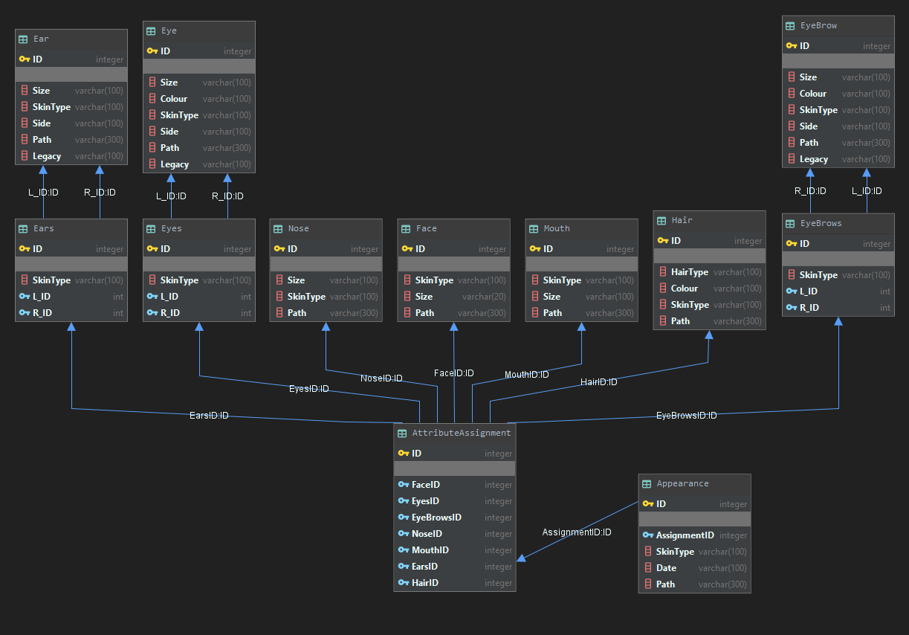

# FaceGeneratorApp
## Overview
FaceGeneratorApp is an database project written in python, JavaScript, and sql
## Description
Korzystając z wygenerowanych przez AI twarzy: https://generated.photos/ tworzymy aplikacje, która z dostępnych elementów generuje zmodyfikowane twarze.    
Schemat bazy danych wykorzystany przy tworzeniu aplikacji:


## Database Methods
* addEyes – dodaje parę oczu do bazy danych
* addEars – dodaje parę uszu do bazy danych
* addEyeBrows – dodaje parę brwi do bazy danych
* addNose – dodaje nos do bazy danych
* addMouth – dodaje usta do bazy danych
* addHair – dodaje włosy do bazy danych
* addFace – dodaje szablon (tło) twarzy do bazy danych
* addAttributeAssignment – tworzy przypisanie wybranych elementów twarzy i dodaje do tabeli AttributeAssignment
* addAppearance – na podstawie AttributeAssignment tworzony jest wpis do tabeli zawierający elementy wygenerowanej twarzy, datę generowania, oraz ścieżkę. 

W celu uproszczenia tworzenia wpisów w bazie danych ograniczono się do skorzystania z następujących przykładowych danych:
* eye colors [blue, green, black, brown]
* skin types [white, black]
* eyeBrows colours [bright, dark]
* hair colours [bright, dark]
* hair type[long, short]
* sizes [small, medium, large]

## Tools
* Python 3.6
* Sqlite / Django
* JavaScript
* Electron 

## How to run
* Windows
## Future improvements
* ~~Stworzenie kompletnego schematu bazy danych~~
* ~~Implementacja w SQL(wyzwalacze, procedury składowane)~~
* ~~Stworzenie wstępnego algorytmu generowania twarzy~~
* ~~Implementacja testowego generatora~~

## Face Generator Desktop App
### What is Face Generator Desktop App (FGDA)
Face Generator Desktop App (FGDA) is written in JavaScript using Electron framework. You can read more about Electron [here](https://www.electronjs.org/docs)

FGDA is a simple desktop app that's used to select proper masks/vectors of given face.
Using FGDA we can select:
* Face mask
* Left ear mask
* Right ear mask
* Left eye mask
* Right eye mask
* Left eyebrow mask
* Right eyebrow mask
* Hair mask
* Mouth mask
* Nose mask

Those masks are a 2 dimensional arrays. Each array contains arrays with two values. Those values are **x** and **y** position of a point.
Later those points are used to cut image into proper pieces which are used in generator.

**Sample data**
```
{
  "face":[[5,477],[17,452],[32,432],[44,415],[52,399],[56,385],[60,365],[64,320],[65,292],[70,263],[76,214],[80,190],[84,160],[93,123],[104,97],[115,80],[129,59],[142,41],[165,23],[181,16],[204,7],[217,5],[241,4],[276,3],[299,7],[330,24],[353,42],[373,62],[395,97],[407,123],[424,168],[428,201],[440,254],[448,288],[464,321],[477,343],[479,357],[478,479]],
  "l_eye":[[216,232],[209,223],[201,217],[191,212],[172,212],[158,215],[149,222],[143,230],[143,236],[156,243],[175,243],[191,242],[206,239],[215,235]],
  "r_eye":[[272,230],[278,219],[287,213],[298,210],[315,210],[324,213],[331,219],[337,226],[339,234],[323,241],[303,243],[291,242],[282,239],[274,236]],
  "mouth":[[190,342],[198,341],[205,337],[212,335],[218,331],[224,329],[228,328],[235,329],[241,332],[246,331],[252,329],[255,329],[262,332],[267,336],[271,338],[278,339],[282,339],[286,340],[288,340],[282,346],[274,348],[267,352],[255,357],[245,358],[233,358],[224,357],[212,353],[203,350],[196,348],[192,346]],
  "nose":[[224,303],[215,301],[206,297],[204,292],[204,286],[207,277],[210,271],[214,266],[217,261],[221,256],[222,252],[224,245],[225,239],[226,233],[226,228],[227,224],[233,221],[242,221],[247,222],[250,226],[251,233],[253,241],[255,250],[258,261],[262,269],[265,277],[270,285],[272,290],[270,298],[267,302],[260,305],[252,306],[244,303],[237,302],[231,304]],
  "l_ear":[[122,303],[119,290],[113,275],[108,265],[107,255],[105,267],[102,290],[102,299],[108,304],[115,306],[119,306]],
  "r_ear":[[367,309],[374,309],[382,310],[384,301],[384,290],[380,279],[374,266],[370,287],[368,298]],
  "hair":[[229,83],[255,84],[277,90],[304,96],[320,114],[336,153],[350,193],[367,237],[373,260],[382,281],[384,291],[384,301],[382,312],[375,308],[368,308],[359,334],[351,357],[336,381],[345,404],[344,420],[338,446],[328,466],[313,479],[479,477],[478,359],[476,340],[464,324],[448,289],[440,256],[427,204],[422,170],[407,124],[395,101],[371,62],[352,44],[332,25],[298,10],[276,5],[242,4],[215,7],[206,7],[179,15],[163,22],[142,41],[133,59],[115,80],[100,96],[94,122],[86,161],[81,188],[76,218],[71,261],[65,296],[62,320],[58,368],[57,385],[53,396],[44,418],[36,432],[18,453],[5,478],[161,477],[161,449],[159,420],[156,400],[151,379],[140,363],[128,344],[123,326],[121,308],[112,304],[105,299],[101,296],[101,286],[102,280],[104,262],[107,255],[107,241],[109,218],[112,196],[116,175],[120,157],[125,136],[136,122],[147,109],[164,95],[181,89],[202,84],[215,82]],
  "l_eyebrow":[[130, 205],[139, 202],[149, 198],[162, 201],[173, 201],[185, 200],[197, 200],[205, 200],[212, 199],[216, 196],[211, 192],[200, 187],[183, 187],[169, 186],[158, 186],[147, 189],[136, 195],[132, 199]],
  "r_eyebrow":[[268, 200],[276, 191],[291, 188],[306, 186],[324, 186],[336, 191],[345, 199],[331, 198],[317, 196],[297, 196],[282, 198]]
}
```

### How to run Face Generator Desktop App (FGDA)
You need to install [Node.js](https://nodejs.org/en/) to be able to use [npm](https://www.npmjs.com/) packages.

Go into FaceGeneratorDesktop directory and run this command:
`npm install`
This command will install all packages
Then if you want to run app use
`npm start`
It will start the app in debug mode (with console open).

## Attributions 
TODO
## Credits
* **Michał Popiel** - *GUI* - [ReQezeR](https://github.com/ReQezeR)
* **Norbert Młynarski** - *Generator-współbieżność* [bibiosm98](https://github.com/bibiosm98)
* **Nikodem Janaszak** - *Database* [NikodemJanaszak](https://github.com/NikodemJanaszak)
* **Jakub Kusiowski** - *Generator-Aplikacja do tworzenia danych* [JKusio](https://github.com/JKusio)


## License
[MIT](https://choosealicense.com/licenses/mit/)

The project was conducted during the Database Lab course, Poznan University of Technology.
Supervisor: Krzysztof Zwierzyński

